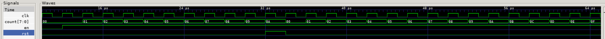

# task1 result
## original code result
the original code waveform is shown as in Fig.1.

the rst signal has been reseted when counter reaches 0x09, and this is because of:
`code` top->rst = (i<2) | (i==15);
